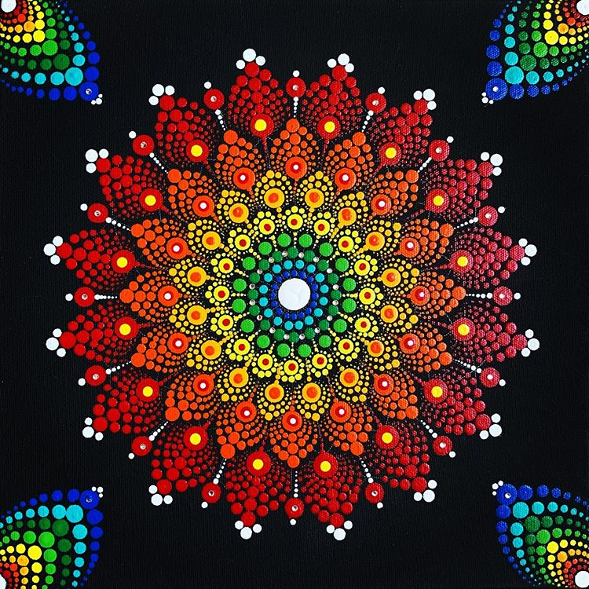
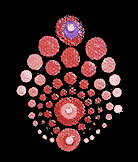
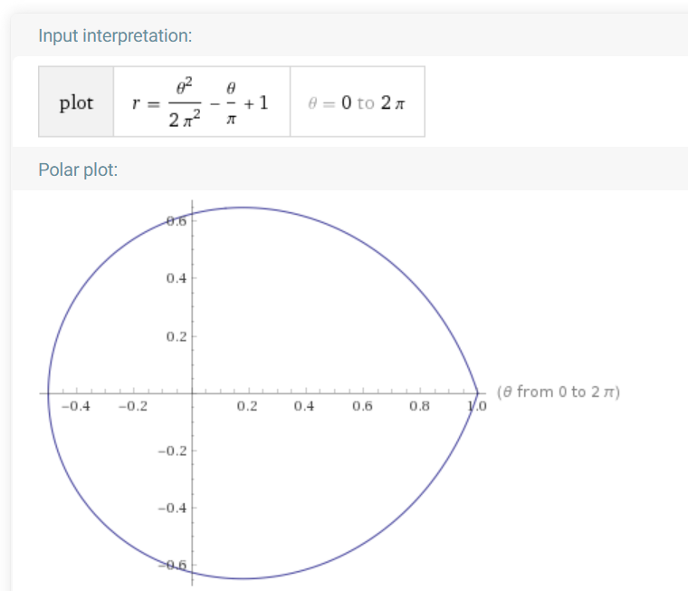
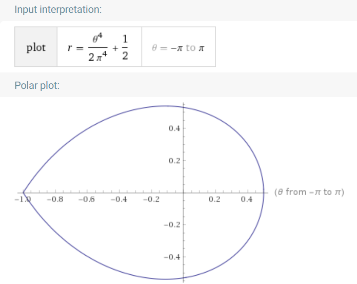
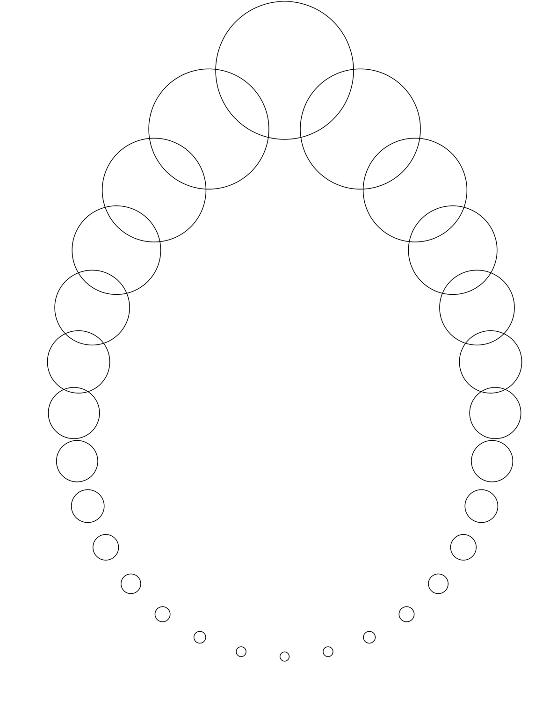
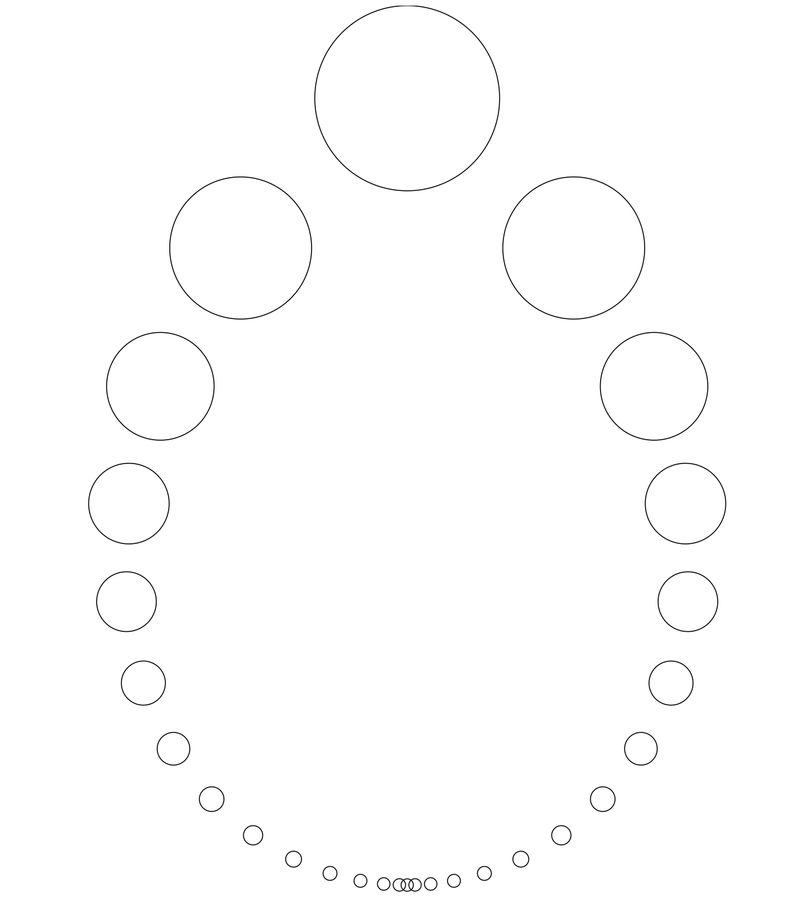

I've been interested in computer-generated
art for as long as I can remember. My first serious dabbling in
computers programming was to generate lines, colors, patterns, and then
when I found fractals, my mind exploded! In the years since then, others
have put much more energy into harnessing the power of fractals for art
than I have been able to. Recently, however, I've come across a style of
art that, while manual, is very intriguing to me. I believe it's
referred to as mandala dot art. The example below comes from
<https://www.instagram.com/p/B9TJ1XhA1Az/>, by
[CampersCamperStudio](https://www.instagram.com/camperscamperstudio/).

This has lots of similarity to fractals, which I'm sure is one of the
reasons it caught my attention. I think I can find a way to model this
mathematically, which would create lots of creative opportunities with
it. I imagine being able to easily tweak parameters of how it's drawn,
as well as adding animation to it. Let's see what we can do!

Part I -- Modeling The Smallest Part
------------------------------------

If this can be modeled, we have to consider the smallest repeating
pieces. The most fundamental shape in this is the circle, of which the
whole thing is composed, but just above that is a leaf/egg-looking
shape. I took this from <https://www.instagram.com/p/BrKMGqmlJjf/>:

I've cut out the pieces of the shape next to it, so the
outermost layer is incomplete, but we can imagine what it ought to look
like. To me, this looks like it wants to be described by a polar
equation. If we just focus on the outermost layer, and imagine a smooth
shape along which all the dots are placed, with θ=0 at the top,
we have a curve that has its maxima at 0 and 2π, and its minimum at π.
It's worth noting that in my head, the origin in this diagram is the
center of all the concentric shapes.

Ok so we'll need a function of r in terms of θ that has a value
of 1 (we'll say that's the maximum radius in this picture) at 0 and 2π,
and a value of .5 at π (I think the bottom is about half as distant from
the middle as the top is). The simplest way I can think of to accomplish
this is with a quadratic equation. It will look like
. If you've taken math more recently than
me, you might have a quick way to do this off the top of your head. I
don't know it, so I'll just do it the hard way.

Here's what we know:

 and it follows that 

Next we have

Substituting , we have
, which through
some ~~magic~~ algebra we can get to tell us that .
Finally we have our middle point which tells us that
. Plugging in what we know about *c*
and *b*, we get  , which
simplifies to , so our complete equation is:

With a little help from Wolfram Alpha, I get this plot:

... which is not what I want. I'm looking
for a shape that meets at a sharper curve at the top. For simplicity's
sake, I'm considering the top moving forward to be π and -π,
and the bottom to be 0. In these terms, let's try an equation of the
form

When θ = π or θ = -π, r = 1. So
 or , hence our
whole polar equation is

The plot for this one looks much better:

Now that we have an initial form of the polar equation, we can create a
function to draw circles with their centers at points on that curve. If
it were complete, I think there would be about 28 circles. For the first
run, we'll just throw 28 circles on that curve, splitting the circle
into 28 equiangular sections.

With some fiddling, I'm able to get the following figure (this is
generated by the code at
[this](https://github.com/bobdunn/drawing-with-raphael-js/tree/e8c436b1627e8a8f7c9398584195267daa561904)
commit: 

We need to adjust the size and the spacing of these circles, then we'll
be ready to add color and layers. First, the sizing:

This is drawn on a canvas whose coordinates are abstracted to a square
from (-1, -1) to (1, 1). The size of each of the circles is 0.05. To
start, I'll guess that the biggest circle needs to be 0.15, and the
smallest needs to be .01. We can vary this with θ with 
. The result (from
[this](https://github.com/bobdunn/drawing-with-raphael-js/tree/d764e9d9a0b8b67fd189a2cd665ed785453426c5)
code) is: t

The next step is more complex. Currently I'm using a simple for loop
from -π to π, at a rate of 2\π/28. Now the size of the steps
needs to change, but it still needs to have 28 steps that add up to
2π. For simplicity's sake I think I'll make this one var linearly.
Number the steps from -14 to 14. It's worth noting that both ends
correspond to the top point. The first could be considered the step
*from* the top, and the last could be considered the step *to* the top.
These should be the same size of steps. A table might help:

  Step   Step   Relative Size
  ------ ------ ---------------
  14     -14    14
  13     -13    13
  12     -12    12
  11     -11    11
  10     -10    10
  9      -9     9
  8      -8     8
  7      -7     7
  6      -6     6
  5      -5     5
  4      -4     4
  3      -3     3
  2      -2     2
  1      -1     1
  0      0      ?

The 0s are weird. I think the model needs adjustment. What about

  Step   Step   Relative Size
  ------ ------ ---------------
  1      28     14
  2      27     13
  3      26     12
  4      25     11
  5      24     10
  6      23     9
  7      22     8
  8      21     7
  9      20     6
  10     19     5
  11     18     4
  12     17     3
  13     16     2
  14     15     1

Ok this makes m ore sense as they're all counting numbers. I prefer the
symmetry of starting at -14 though, so...

  Step   Step   Relative Size
  ------ ------ ---------------
  -14    13     14
  -13    12     13
  -12    11     12
  -11    10     11
  -10    9      10
  -9     8      9
  -8     7      8
  -7     6      7
  -6     5      6
  -5     4      5
  -4     3      4
  -3     2      3
  -2     1      2
  -1     0      1

The relative size is easy enough to calculate:

We need to know what to scale by so that the sum of all these is $2\pi$.
Remember that the formula for triangle numbers is
. We have two, however, so we'll just
double that, and use . The smallest
step (relative size 1) will be 1/210 of the circle.
[This](https://github.com/bobdunn/drawing-with-raphael-js/tree/1a205b0e60d033071b4abc4391f116e92c1cc27c)
gives us:

